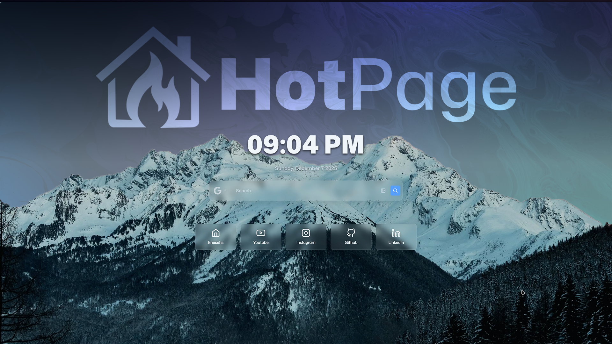

<h1 align="left">HotPage</h1>

<p align="left">
  
</p>

HotPage is a React 19 + TypeScript + Vite 7 powered new-tab homepage. It ships with a widget-first layout, a glassmorphic settings panel, multi-source backgrounds, and persistent personalization for every session.  
This README is emoji-free and the project is released under the MIT license.

---

## Live Demo
**https://enesehs.dev/Hotpage**

---

## Badges

<p align="left">

  
  

  <a href="https://github.com/enesehs/Hotpage/stargazers">
    
  </a>

  
  

  <a href="https://chrome.google.com/webstore/detail/___HOTPAGE_ID___">
    
  </a>

  <a href="https://addons.mozilla.org/en-US/firefox/addon/___HOTPAGE_ID___/">
    
  </a>

  <a href="./LICENSE">
    
  </a>

</p>

---

## Screenshots

<p align="left">
  
  
</p>

---

## Highlights

- Search-first experience with multiple engines and optional image mode  
- Widget stack: Clock, Quick Links, Weather, Currency/Crypto, RSS, Quotes, Sticky Notes with Pomodoro/Todo, Secret Links, Intro Modal  
- Theme system built on CSS variables with predefined + custom themes  
- Background engine (solid / gradient / remote / uploaded)  
- Localized UI (TR/EN)  
- Persistent settings, schema-safe defaults  
- MV3 browser extension support

---

## Upcoming Features

- [ ] Custom Quotes  
- [ ] Spotify Now Playing  
- [ ] Reverse Image Search  
- [ ] Multi-Lang Support  
- [ ] AI Search  
- [ ] Responsive Design  
- [ ] Google Calendar Integration  
- [ ] Image Optimization  

---

## Feature Details

- **Search Bar**  
  Switchable engines (Google, Chrome, Brave, Yandex, DuckDuckGo, Bing, Baidu, Wikipedia), image mode, Debounced input.

- **Quick Links**  
  Custom icons, SVG support, reorderable grid.

- **Clock & Quotes**  
  Locale-aware date/time, categorized quotes (wisdom, motivational, humorous, custom).

- **Weather**  
  Auto/manual city mode, interval refresh, fallback detection.

- **Currency / Crypto**  
  Separate tabs, curated lists, base currency selection.

- **RSS Reader**  
  Multi-feed structure, category tabs, item extraction and filtering.

- **Sticky Notes**  
  Notes + Todo + Pomodoro timer (focus/break mode, sound alert).

- **Secret Links**  
  Keyword-triggered overlay with folders and incognito option.

- **Intro Modal**  
  First-run welcome with TR/EN adaptive text.

---

## Personalization System

- Predefined themes + full custom theme builder  
- Background presets (solid/gradient) + remote categories  
- User-uploaded backgrounds stored in IndexedDB  
- Blur, overlay opacity, random mode with repeat avoidance  
- Full widget enable/disable system  
- Widget order persistence  
- Locale persistence  
- Keyboard shortcuts:  
  - N → Sticky Notes  
  - Escape → Close overlays  
  - Custom trigger → Secret Links

---

## State and Persistence

- Settings stored in `localStorage` under `hotpage-settings`  
- Backgrounds stored in IndexedDB via `imageStorage.ts`  
- Debounced saving to reduce write load  
- Export/Import helpers  
- Version-aware schema merging system  

---

## Architecture

- React 19 with component-level state management  
- TypeScript 5.9  
- Vite 7 optimized build pipeline  
- CSS Modules per widget  
- `themeUtils.ts` applies runtime CSS variables  
- `themes.ts` stores predefined & custom palettes  
- `storage.ts` handles localStorage persistence  
- `imageStorage.ts` manages IndexedDB caching  
- `SettingsPanel` orchestrates global configuration  

---

## Project Structure

```
src/
   App.tsx
   App.css
   index.css
   main.tsx

   components/
      Clock/
      Currency/
      IntroModal/
      QuickLinks/
      Quotes/
      RSS/
      SearchBar/
      SecretLinks/
      SettingsButton/
      SettingsPanel/
      StickyNotes/
      Weather/

   data/
      icons.ts
      quotes/
      translations.ts

   services/
      storage.ts
      imageStorage.ts

   types/
      settings.ts
      theme.ts
      widget.ts

   utils/
      logger.ts
      pomodoroSound.ts
      searchEngines.ts
      themes.ts
      themeUtils.ts

public/
   manifest.json
   img/
   fonts/
   video/
```

---

## Development

```
npm install
npm run dev
```

---

## Production Build

```
npm run build
npm run preview
```

---

## Lint

```
npm run lint
```

---

## Browser Extension Usage

### Chrome Steps

```
npm run build
```

1. Go to: chrome://extensions  
2. Enable Developer Mode  
3. Load Unpacked → select `/dist`

---

### Firefox Steps

```
npm run build
```

1. Go to: about:debugging#/runtime/this-firefox  
2. Load Temporary Add-on → select `/dist/manifest.json`

---

## Developer
- **Enesehs** — https://enesehs.dev  
- **Source Code** — https://github.com/enesehs/Hotpage  

---

## Support
- Buy Me a Coffee: https://buymeacoffee.com/enesehs  

---

## Configuration Notes

- Settings stored in `localStorage` under `hotpage-settings`  
- Uploaded backgrounds stored in IndexedDB via `imageStorage.ts`  
- Random background mode avoids immediate repeats  
- Config export/import included in `storage.ts`  

---

## License

This project is licensed under the **MIT License**.
