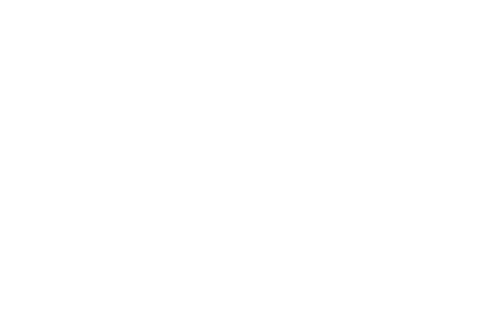
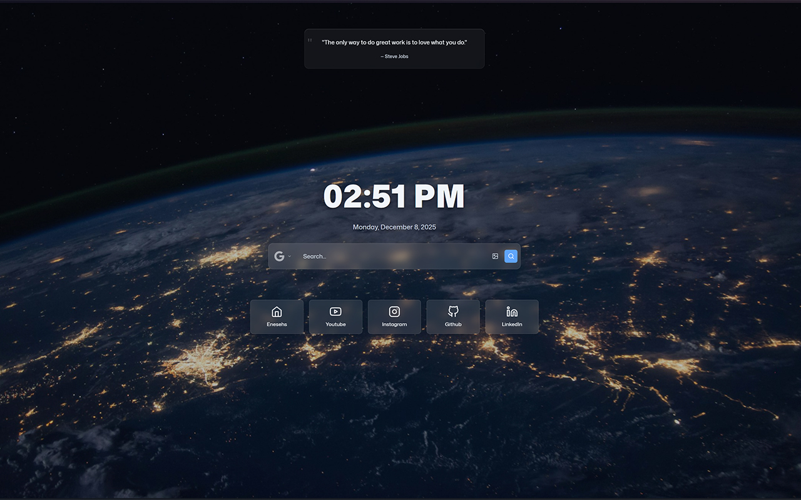
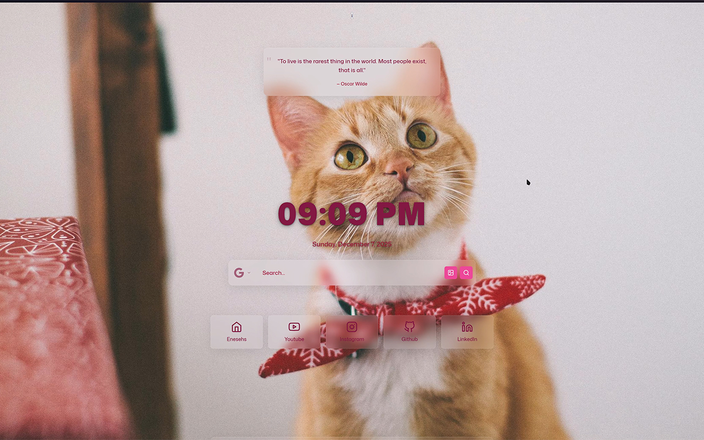

<p align="center">
  
</p>


<p align="center" style="font-size: 1.2em; color: #666; margin-bottom: 2em;">A Modern, Customizable New Tab Hotpage</p>
<p align="center">
  
  
  
  </a>
  <a href="https://github.com/enesehs/Hotpage/stargazers">
    
  </a>
</p>

<p align="center">
  <a href="https://chrome.google.com/webstore/detail/___HOTPAGE_ID___">
    
  </a>
  <a href="https://addons.mozilla.org/en-US/firefox/addon/___HOTPAGE_ID___/">
    
    </a>
</p>

<p align="center">
  <svg width="60%" height="2">
    <rect width="100%" height="2" fill="#d0d4d8" />
  </svg>
</p>

## Project Introduction

<p align="center" style="max-width:700px;margin:auto;">
HotPage is a premium new-tab homepage extension that transforms your browser's default new tab into a personalized, widget-rich dashboard. Built with React 19 and TypeScript, it offers a glassmorphic design system, multi-source backgrounds, and persistent personalization across sessions.
</p>

<p align="center" style="max-width:700px;margin:auto;">
Designed for productivity-focused users who want a clean, customizable start page without distractions. Whether you're a developer, designer, or power user, HotPage adapts to your workflow with intelligent widgets and seamless integration.
</p>

<p align="center">
  <svg width="60%" height="2">
    <rect width="100%" height="2" fill="#d0d4d8" />
  </svg>
</p>

## Live Demo & Screenshots

<p align="left">
  <a href="https://enesehs.dev/Hotpage" style="text-decoration: none;">
    
  </a>
</p>

<p align="center">
  
</p>

<p>
  
  
</p>

<p align="center">
  <svg width="60%" height="2">
    <rect width="100%" height="2" fill="#d0d4d8" />
  </svg>
</p>

## Key Features

### Core Functionality
- **Search-First Experience**: Multiple search engines with optional image mode and debounced input
- **Widget Ecosystem**: Comprehensive set of productivity widgets including Clock, Weather, Currency, RSS, and more
- **Persistent Personalization**: Settings and preferences saved across browser sessions
- **Multi-Browser Support**: Chrome and Firefox extension compatibility with MV3 architecture

### Design & Theming
- **Glassmorphism UI**: Modern frosted glass effects with backdrop blur and transparency
- **Advanced Theme System**: Predefined themes plus custom theme builder with CSS variables
- **Background Engine**: Solid colors, gradients, remote images, and user-uploaded backgrounds
- **Responsive Layout**: Adaptive design that works across different screen sizes

### Productivity Tools
- **Quick Links**: Customizable icon grid with SVG support and reordering
- **Sticky Notes**: Integrated notes, todo lists, and Pomodoro timer with sound alerts
- **Secret Links**: Keyword-triggered overlay for private bookmarks with incognito support
- **Localization**: Multi-language support with Turkish and English interfaces

<p align="center">
  <svg width="60%" height="2">
    <rect width="100%" height="2" fill="#d0d4d8" />
  </svg>
</p>

## Widget Breakdown

### Search Bar
A powerful search interface supporting multiple engines including Google, DuckDuckGo, Bing, and Wikipedia. Features image search mode and intelligent debouncing for smooth performance.

### Clock & Quotes
Displays locale-aware time and date with a curated collection of inspirational quotes. Supports multiple categories including wisdom, motivational, and humorous content.

### Weather Widget
Provides real-time weather information with automatic city detection and manual override options. Includes interval-based refresh and fallback handling for reliability.

### Currency & Crypto
Dual-tab interface for tracking traditional currencies and cryptocurrencies. Features base currency selection and curated lists for quick access to market data.

### RSS Reader
Multi-feed news aggregator with category-based organization. Extracts and filters content from multiple sources for personalized news consumption.

### Sticky Notes & Pomodoro
Combined productivity tool featuring note-taking, todo management, and a Pomodoro timer with focus/break modes and customizable sound alerts.

### Secret Links
Privacy-focused bookmark system triggered by custom keywords. Supports folder organization and incognito browsing for sensitive links.

<p align="center">
  <svg width="60%" height="2">
    <rect width="100%" height="2" fill="#d0d4d8" />
  </svg>
</p>

## Design System

### Color Palette
HotPage uses a carefully crafted color system built on CSS custom properties. The palette includes semantic colors for primary actions, secondary elements, and status indicators, ensuring consistent visual hierarchy across all components.

### Theme Engine
Powered by `themeUtils.ts`, the theme system dynamically applies CSS variables at runtime. Supports both predefined themes and user-created custom themes with real-time preview and persistence.

### Background System
Advanced background management supporting solid colors, CSS gradients, remote image URLs, and user-uploaded images stored in IndexedDB. Features blur effects, overlay opacity controls, and random rotation with repeat avoidance.

### Glassmorphism Implementation
Achieves the signature frosted glass effect through CSS backdrop-filter properties combined with carefully tuned opacity and blur values, creating depth and modern aesthetics.

<p align="center">
  <svg width="60%" height="2">
    <rect width="100%" height="2" fill="#d0d4d8" />
  </svg>
</p>

## Architecture Overview

### Technology Stack
- **Frontend**: React 19 with TypeScript 5.9 for type-safe component development
- **Build System**: Vite 7 for optimized development and production builds
- **Styling**: CSS Modules for scoped component styling with glassmorphism effects
- **Browser APIs**: Chrome Extension API and Firefox WebExtensions for cross-browser compatibility


<p align="center">
  <svg width="60%" height="2">
    <rect width="100%" height="2" fill="#d0d4d8" />
  </svg>
</p>

## Installation & Getting Started

### Prerequisites
- Node.js 18+ and npm
- Modern web browser (Chrome 88+, Firefox 85+, or Edge 88+)

### Development Setup
```bash
# Install dependencies
npm install

# Start development server
npm run dev

# Build for production
npm run build

# Preview production build
npm run preview
```

### Custom Build Extension Installation

#### Chrome
1. Run `npm run build` to generate the extension bundle
2. Open `chrome://extensions` in Chrome
3. Enable "Developer mode" in the top right
4. Click "Load unpacked" and select the `dist` folder

#### Firefox
1. Run `npm run build` to generate the extension bundle
2. Open `about:debugging#/runtime/this-firefox` in Firefox
3. Click "Load Temporary Add-on"
4. Select the `dist/manifest.json` file

<p align="center">
  <svg width="60%" height="2">
    <rect width="100%" height="2" fill="#d0d4d8" />
  </svg>
</p>

## Privacy & Permissions

HotPage is designed with privacy as a core principle, requesting only essential permissions for functionality.

### Minimal Permissions
- **Storage**: Local storage for settings and IndexedDB for user-uploaded backgrounds
- **Tabs**: Required for opening links and managing new tab behavior
- **ActiveTab**: Used for search functionality and link opening

### Data Handling
All user data remains local to the browser. Settings are stored in localStorage, and uploaded backgrounds use IndexedDB. No data is transmitted to external servers except for widget-specific API calls (weather, currency rates, RSS feeds) which are handled directly by the respective services.

<p align="center">
  <svg width="60%" height="2">
    <rect width="100%" height="2" fill="#d0d4d8" />
  </svg>
</p>

## Upcoming Features

- [ ] Custom Quotes Collection
- [ ] Spotify Now Playing Integration
- [ ] Reverse Image Search Capability
- [ ] Expanded Multi-Language Support
- [ ] AI-Powered Search Features
- [ ] Enhanced Responsive Design
- [ ] Google Calendar Integration
- [ ] Advanced Image Optimization

<p align="center">
  <svg width="60%" height="2">
    <rect width="100%" height="2" fill="#d0d4d8" />
  </svg>
</p>

## Support & Contribution

### Contributing
We welcome contributions to HotPage! Please follow these guidelines:
- Fork the repository and create a feature branch
- Ensure code follows TypeScript best practices
- Test changes across Chrome and Firefox
- Submit a pull request with a clear description

### Reporting Issues
Found a bug or have a feature request? Please:
- Check existing issues before creating new ones
- Include browser version, OS, and steps to reproduce
- Provide screenshots for UI-related issues

### Support the Project
If you find HotPage useful, consider supporting development:
- ⭐ Star the repository on GitHub
- ☕ [Buy Me a Coffee](https://buymeacoffee.com/enesehs)
- 🔗 Visit [enesehs.dev](https://enesehs.dev) for more projects

<p align="center">
  <svg width="60%" height="2">
    <rect width="100%" height="2" fill="#d0d4d8" />
  </svg>
</p>

## License

This project is licensed under the MIT License - see the [LICENSE](LICENSE) file for details. The MIT License allows for free use, modification, and distribution of the software, provided that the original copyright notice and license terms are included in all copies or substantial portions of the software.
